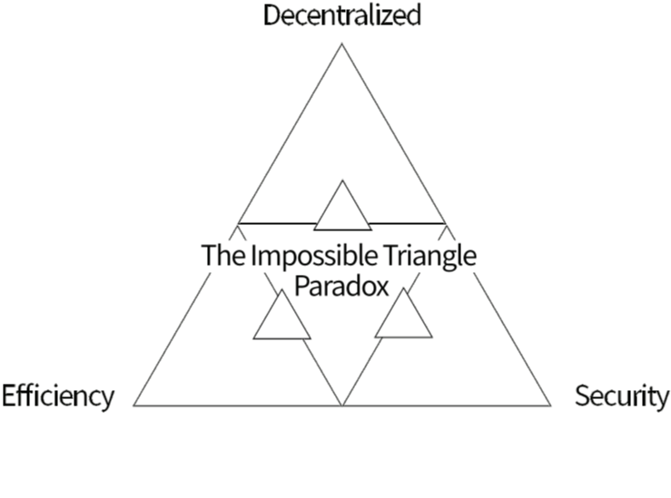
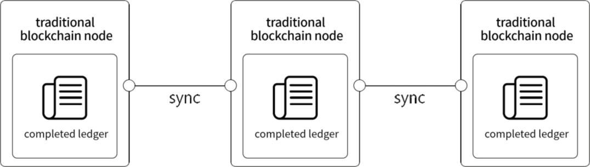
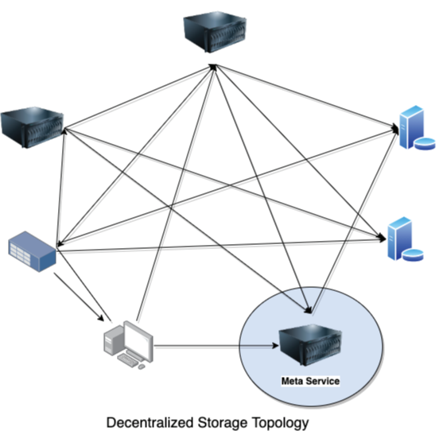
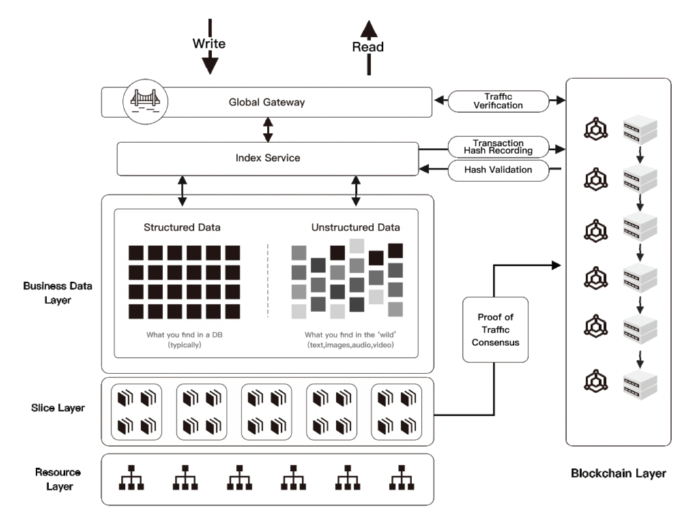
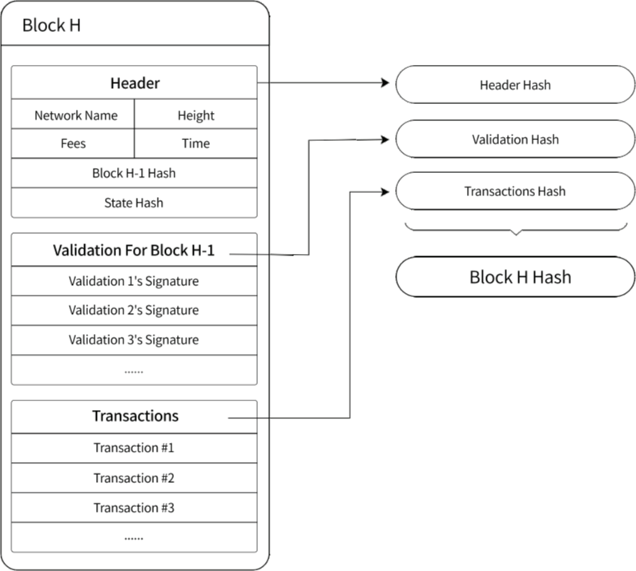
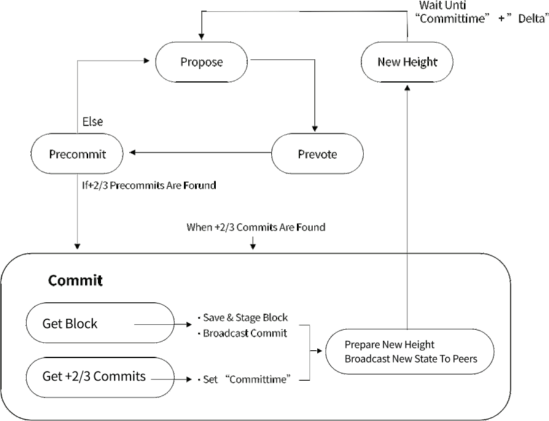
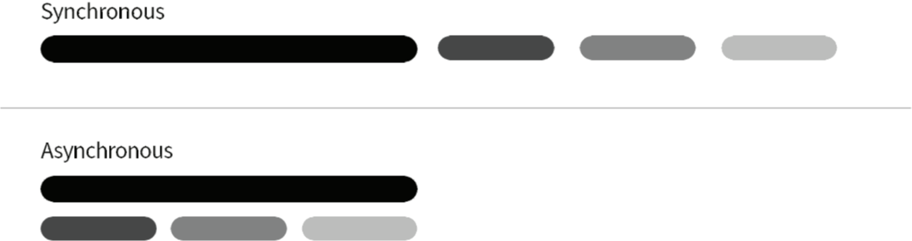
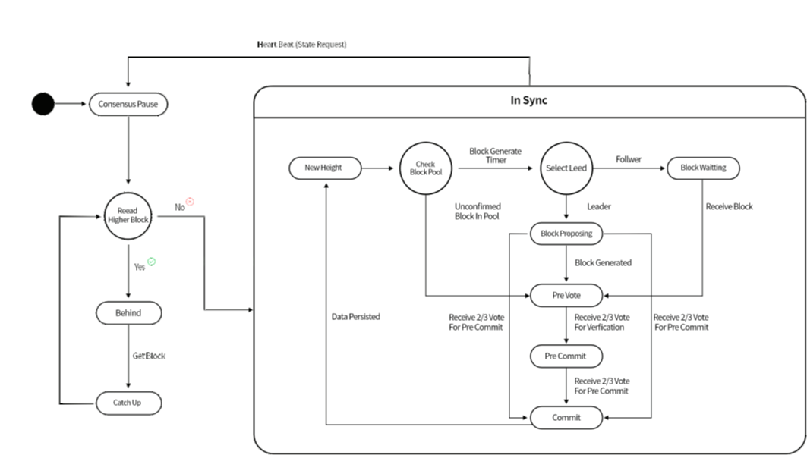
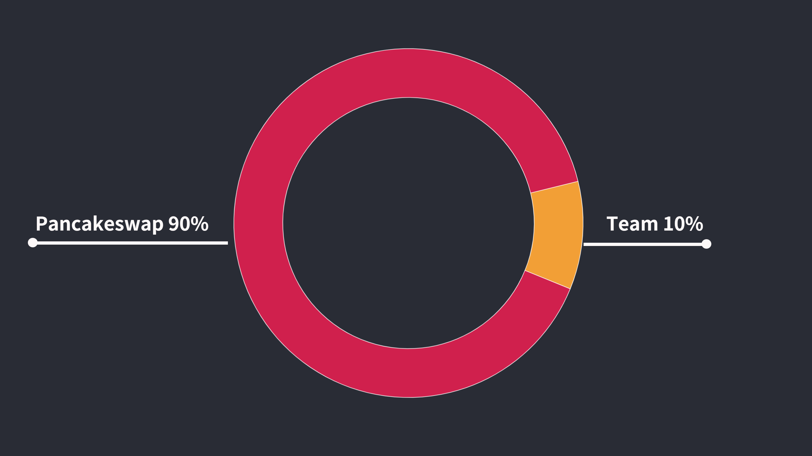

# Martis WhitePaper

#### 
Published in 2022

#### 
version 0.1.2

---

## Introduction

Martis is a large-scale distributed infrastructure network. Martis provides three-in-one resources which include computation, storage and network traffic. Martis uses Proof-of-Traffic algorithms to reward infrastructure participants and contributors in accordance with network traffic. At the same time, Martis uses its own blockchain to measure the usage of computing resources (computation, storage and network traffic), and uses Practical Byzantine Fault-Tolerant consensus algorithm (PBFT) to integrate the network Proof-of-Traffic consensus algorithm deeply, providing settlement services and related financial payment services for network providers and network users in an efficient, fair and transparent manner.

Martis is a decentralized data mesh for blockchain, it defines the next generation of decentralized computing services that can serve Dapp, allowing smart contract developers such as Uniswap, AAVE and NFT Dapps to use 
decentralized infrastructure to deploy, store and execute their code and data, so the community developers can publish the system without complicated network deployment.

The developers can fully focus on the product business logic without worrying about the underlying infrastructure, making development and operations more effective and reducing development costs.

Martis aims to build a distributed network ecosystem with infrastructure providers, middleware developers, and Dapp developers for common development, sharing value, and efficient commitment to provide credible, reliable, and low- cost applications for the prosperity of blockchain applications. Martis will offer an indestructible environment for all the Dapps and no one will take your application down.

## Current Situation And Thought

### 1. Current situation and thought

#### 1.1 Thoughts triggered by Bitcoin, Ethereum smart contract and blockchain technology

In 2008, Satoshi Nakamoto introduced a method which is implemented entirely through peer-to-peer technology Electronic cash system in his paper <Bitcoin: A Peer-to-Peer Electronic Cash System> [1]. It enables online payments to be directly initiated by one party and paid to the other party without any financial institution in the middle. Bitcoin created a precedent for a decentralized encrypted digital currency, becoming the first fully distributed digital encrypted currency that can complete transactions without any intermediary. To date, the total market value of Bitcoin has exceeded $290 billion. People usually call the digital cryptocurrency system represented by Bitcoin the blockchain technology version 1.0.

Between 2013 and 2014, Vitalik Buterin proposed the concept of Ethereum. Ethereum is an open source, public blockchain platform with a smart contract function. Ethereum provides an internal Turing complete scripting language, which allows users to build and process peer-to-peer smart contracts or transaction types by using its dedicated encrypted digital currency Ethereum (ETH). Up to now, the total market value of Ethereum has exceeded 48 billion U.S. dollars. People usually refer to the combination of digital encryption currency represented by Ethereum and smart contracts as version 2.0 of blockchain technology.

Blockchain technology is a self-referential data structure used to store a large amount of transaction  information. Each record is linked in an orderly manner from back to front. It is open and transparent,  cannot be tampered with, and is easy to trace. The blockchain itself uses computer network technology  to compulsorily process many asynchronously executed nodes in different ways of synchronous  information processing to achieve the consensus of all nodes in the system. This process does not require  any centralized node to provide services or credit endorsement. In short, it greatly reduces the cost of  establishing credit among all nodes in the system. Once this kind of point-to-point credit verification is  applied in a real business environment, it will greatly eliminate the cost of trust between various nodes  in the value chain, so the transaction information which is transferred between nodes can be valued  differently without third-party verification or endorsement. 

Since human society began to enter the stage of commodity economy, all commercial activities are  inseparable from the effective flow of three types of values, namely information flow, logistics and value  flow. Any behavior that effectively improves efficiency or reduces costs in the liquidity of any type of  value can create a huge incremental trading market for the commodity economy. The birth of advanced  transportation tools, such as ships, trains and airplanes, have greatly improved the efficiency of logistics,  reduced logistics costs, and created the possibility of commodity circulation in the global market. The  inventions of the telegraph, telephone, fax machine and the Internet have greatly improved the efficiency  of information flow and reduced the cost of information flow, so that commodity information can reach  a wider range of consumer groups and meet or even give birth to transaction needs. The emergence of  banknotes, checks, credit cards, and electronic payment methods have greatly improved the efficiency of  value transfer, greatly reduced costs, and greatly accelerated the capital turnover of all parties, so that less  capital can be used to meet the needs of larger-scale transactions.

The essence of blockchain technology is to combine information flow and value flow into one, and at  the same time, make it possible to complete point-to-point direct transaction confirmation without  any third-party providing credit endorsement or intermediary services, which makes the value chain in  any commercial field. The transactions between all participants (that is, participants in all transaction  behaviors) can be automatically executed based on the smart contract developed between them, and  the execution process is open and transparent, cannot be tampered with and can be traced. This greatly  eliminates the cost of trust between transaction participants, and simplifies the multiple, multi-layer,  asynchronous transaction process in the value chain into a one-time automatic transaction process in  which all participants participate. Such a transaction method will counteract all participants in the value  chain, and promote them to establish a consensus mechanism from the perspective of maximizing the  benefits of the overall value chain, thereby greatly changing the production relationship between the  participants, from the original distrust and even opposition to each other. The mode of infringing interests  is transformed into a mode of establishing collective consensus, transferring and sharing interests, and  further liberating the productivity of all parties in the overall value chain.

Although the various application ideas and scenario designs of blockchain technology are blooming, all attempts to implement these ideas and scenarios into applications face many common problems:

1. A completely decentralized design concept cannot coexist with security and high efficiency at the same time (“the impossible triangle paradox”). Therefore, the consensus mechanism of Martis and the design of the network topology must achieve a compromise and balance between the three.

1. At present, with the exception of a very small number of companies, the application and  development of blockchain all encounters a lack of infrastructure and middleware, and the bottleneck  of throughput, making the possibility of designing complex smart contracts almost non-existent. This  prevents the possibility of using blockchain technology to solve various demand scenarios in the real  world.

2. Blockchain, as an emerging technology, lacks regulatory laws and benign institutional design,  combined with the financial attributes of blockchain technology itself, the cost of evildoing by blockchain  practitioners has become very low, which has led to various financial scams and air currency projects.  Deepening the public’s negative impression of blockchain technology, making the popularization and  implementation of blockchain technology encounter greater obstacles.

#### 1.2.  Decentralized Storage problems and challenges faced by public chain and DApp developers

In a decentralized computing network, how to solve the access reliability of network nodes and how to  deal with the sudden increase of large-scale network traffic effectively while taking into account efficiency  and cost has always been a difficult problem to solve. And these uncertain and unstable problems have  caused headaches for many blockchain projects that require storage services, because no team will rely  on services for which reliability and stability are uncertain. So why don’t so many blockchain projects want  to develop their own or even involve storage services?

Keeping a complete ledger at each node is an important feature of the current blockchain, but it is also  a pain point of blockchain data storage. The size of the blockchain ledger can only be determined by the  local storage of each node, and has nothing to do with the total storage size of the overall blockchain network. Since each node is an independent server (whether it is a physical machine or a virtual machine),  the local storage capacity is destined to have a physical upper limit. In this case, the entire blockchain can  only store a few terabytes of data, which is why most blockchain projects don’t want to touch storage,  because the blockchain is not designed to support storage expansion.

In order to solve the problem of reliability and efficiency of decentralized storage network, Stratos data  mesh provide a meta service layer to execute the varies management services include indexing, routing,  auditing tasks through Proof-of-Authority [3], and the meta services will ensure that the number of copies  of all files in the P2P network is maintained basic quantity (default is 3) at any time. Multiple replications  can greatly improve the reliability of file access, and different networks where different copies are located  can provide sufficient redundant network resources, which can solve the overall reliability and efficiency  problems effectively. At the same time, such a storage network is no longer an ordinary storage network,  but a decentralized data mesh.

## The Goal And Design Philosophy Of Martis

### 2. The goal and design philosophy of Martis

#### 2.1 Martis data mesh

Martis data mesh consist of three main components: decentralized storage, decentralized database and decentralized computation. The decentralized storage and decentralized database provides fast storing/querying services for various data types. Whether the data is structured data or unstructured data, the Martis data mesh will process them in different ways according to the different data type, such as speeding up data query and video playback. 

The Martis data mesh service is composed of the Martis blockchain layer and the Martis resource layer, which cooperate with each other to provide services for users. 

The blockchain layer provides service fee settlement, miner incentive mechanism settlement, payment services, and verification services for the resource consumption in the data mesh. The resource layer provides computing, storage and network services. The storage layer of the resource node determines the storage method according to different data types, such as storing in a structured way or storing it in unstructured pictures, music, encrypted files or videos. The effcient query method will adopt different execution strategies according to different data types.

Combine with Martis blockchain data mesh service provides the full scaled infrastructure for all kinds of enterprise level applications and customer-oriented applications.   

Data mesh service is another new innovation in the information age following the Internet and computers.  Martis data mesh provide a decentralized resource management platform to help the customer to leverage the resources provided by the whole data mesh network. Decentralized computing is a great leap in the information age. The future era may be the era of decentralized computing. With the help of data mesh service, users can obtain unlimited resources through the network, and the obtained resources are not limited by time and space.  

Martis data mesh will provide the computing resources include storage, network traffic and computation capability which generally provided by centralized giant companies. The decentralized services provided by data mesh user no longer locked to any company and they can acquire the resources safe and secure. 

Small data centers have the advantages of low construction cost, low site requirements and low local energy requirements. Many companies own data centers. Many entities include school and institution have their own data center but never fully use their available resources. Since the deployment density of small data centers is much greater than that of large data centers, in terms of physical distance, small data centers will be closer to customers than large data centers, which can help customers reduce network delays and provide customers with richer services options based on geographic location. Martis data mesh will be able to attract these small data centers to work together to provide decentralized computing services.  

The Martis blockchain collects and verifies each task performed in the resource node of each data center, records the usage of specific computing modules, memory modules and storage modules, and then writes to the chain after consensus process. The service provider receives the Martis token directly which is calculated by the smart contracts. Users of data mesh will directly pay Martis Token based on usage of resources.

#### 2.2 Martis design philosophy

Martis Data mesh service contains three layers: 
* Martis blockchain layer 
    * Provide workload calculation and settlement of the resources layer 
    * Provide digital currency payment
    * Provide storage content verification
* Martis meta service layer
	* Provide the indexing service of the computing resources on the resource nodes 
	* Route the resource access requests to proper resource nodes
	* Audit the traffic (Include the data traffic and computation traffic) report 
	* Perform the network health checking
* Martis resources layer
	* Provide storage services 
	* Provide computing services
	* Provide customized PaaS and SaaS services
	* Martis blockchain uses the Practical Byzantine fault-tolerant consensus algorithm (PBFT) [2] to generate a block every 10 seconds 
	* The resource layer uses Proof-of-Traffic consensus algorithm to calculate the incentive return for each storage service provider 
	* The meta service layer uses Proof-of-Authority [3] consensus algorithm to elect resource nodes dynamically to perform indexing, auditing and routing tasks for the resource layer.

Three different consensus algorithms run on the three levels of Martis Network, complement and depend 
on each other, and jointly ensure the stable and efficient operation of the entire Martis ecosystem.

## Martis Consensus

### 3.Martis consensus

#### 3.1 Tendermint

Tendermint [4] (Consensus without Mining) was designed and published by the Cosmos team in 2014. Tendermint consensus mechanism provides proof of work that does not rely on high power consumption such as mining, but provides fast transaction processing capabilities, security and scalability for blockchain projects which adopt this consensus mechanism.

#### 3.1.1 Tendermint Concept

* Tendermint is software that can safely and consistently replicate applications on different machines. 
Security and consistency are also key concepts of distributed ledger.
* Safety means that if even up to 1/3 of the machines are failed, Tendermint can still work normally.
* Consistency means that each machine that works normally always has the same transaction log and 
calculate the same state.
* Tendermint is a Byzantine fault-tolerant consensus algorithm.

#### 3.1.2 Tendermint consensus algorithm and block structure

#### 3.1.3 Tendermint state machine workflow

#### 3.1.4 Tendermint Consensus algorithm main steps

1. Proposing

    Select the block producer node among the nodes which participating the consensus process.
    
1. PreVote

    The block producer node broadcasts the new block, then other nodes verify the new block. If more than 2/3 of the nodes confirm the validity of the block, then the process moves to the next stage, otherwise the process fails.
    
3. PreCommit 

    After 2/3 nodes verify the validity of the new block, all nodes start to write the block to the local cache. If more than 2/3 of the nodes get it done successfully, then the process moves to the next step, otherwise the process fails.
    
4. Commit 

    After the process receiving the signal f rom more than 2/3 nodes which wrote to the local cache successfully, all the nodes move the new block data f rom local cache to local database.
    
5. New Height

Transition time window to prepare for the next block production.

#### 3.1.5 Synchronous and Asynchronous

In the computer field, synchronization is the sequential execution in the entire processing process, and the result will be returned only after each process has been executed by order. Synchronization can be understood as serial, and the flow of the whole process cannot cross each other.Asynchronous means just sending the called instruction, the caller does not have to wait for the called method to be completely executed, but continues to execute the following process. Asynchronous is a parallel processing method. You can perform other tasks without waiting for the execution of a program.

The difference between synchronous and asynchronous is that one needs to wait, and the other does not need to wait.

As for consensus, the proof-of-work of Bitcoin and Ethereum is actually an asynchronous consensus process, the entire consensus process has no any dependency between inside steps. Any node that gets the validated hash value can broadcast the new blocks to the network at the same time. Each node in the chain works independently during the consensus process and does not need to communicate and cooperate with each other.

For the Tendermint consensus method (BFT+POS) that we adopted, in addition to solving the energy consumption problem, it also solves the problems of POW transaction confirmation, transaction bifurcation, and low performance. The leap brought by it cannot be ignored. Moreover, many famous projects such as EOS, Tezos, Cosmos, etc. all use the consensus method of BFT+POS.

Then the key point of our thinking is that although BFT+POS has many advantages, but the consensus process is a synchronization process of the entire chain. The two stages from Pre-Vote to Pre-Commit requires the entire chain to exceed only 2/3 of the votes can continue to produce blocks, otherwise the consensus process will fail, then all nodes in the entire chain will conduct consensus processing again until they get 2/3 of the votes of the entire chain.

If more than 1/3 of the nodes in the chain have poor network quality or poor machine performance, then other faster nodes and network resources will have to wait for slower nodes (provided that more than 1/3 of the nodes are worse. If the number of bad nodes is less than 1/3, the chain will ignore these slower nodes and produce blocks directly)

Is it possible to adjust some steps in the Tendermint (BFT+POS) consensus, such as:
1. Remove the “New Height” round, because each “New Height” round is the entry point of a synchronous process.
2. Set the two steps of “Pre Vote” and “Pre Commit” are processed asynchronously, if the response cannot be made in the same time window, we will establish a buffer pool, save the temporary data and wait for the response of other nodes before processing, instead of pausing Consensus processing and just waiting.
Based on the above thought, we redesigned the Martis consensus workflow.

The above are some thought of the team and design on the possibility to asynchronous Tendermint process. Next, the team will conduct more research and discussion deeply to determine the feasibility of the asynchronous Tendermint consensus. In the end, the development team will use Tendermint as the basis to develop an enhanced version of Tendermint or unique and efficient PBFT consensus algorithm for Martis.

## Martis Blockchain and Resource Network

### 4 Martis blockchain and resource network

#### 4.1 Martis blockchain

Martis Blockchain is implemented by the core R&D team from scratch and the main language is Go.

#### 4.1.1 Merkle Patricia Tree 

Merkle Patricia Tree [6] (also known as Merkle Patricia Trie) is an improved data structure that combines the advantages of Merkle tree and prefix tree.

The MPT tree has the following functions:

* Stores any length of key-value pair data 
* Provides a mechanism to quickly calculate the hash identifier of the maintained data set
* Provides a mechanism for fast state rollback
* Provides Merkel proof to expand light nodes and realize simple payment verification

In the Account status development module, our development is similar to Ethereum’s account management. Therefore, we choose to use the Merkle Patricia Tree which is used by Ethereum to organize and manage account data, transaction collections, smart contract data, and important data structures for commercial business data

#### 4.1.2. Database Development

Our team chose the LevelDB as the embedded database for blockchain node. LevelDB is a fast key- value storage library. The data in LevelDB is stored sorted by key and it also support multiple change in one atomic batch. The LevelDB is the database applied by Bitcoin for storing Chain states. Chain state, accounts, smart contracts, and transaction data of Martis will all be written to LevelDB

#### 4.2 Resource Network

General speaking, the Martis resource network is composed of resource nodes. Resource nodes provide computing power, storage, and content accessing services. They are also responsible for managing the network, allocating various resources, and ensuring a balanced ratio of all aspects of the network.

#### 4.2.1 DSN Node

#### 4.2.2 DSN Index Node

## Token

### 5 Token

#### 5.1 Martis Token

We issue Martis Tokens based on BSC to raise funds for project development. This is our foundation.

#### 5.2 Capital allocation

In the interest of fairness, we injected a circulation of 90 into Pancake

## TimeLine

### 6 TimeLine

#### 6.1

* Publish Website and Media
* Deploy token
* Securing liquidity, audit

#### 6.2

* Marketing and Advertising
* Publish ETH CrossChain
* Publish Martis SWAP

#### 6.3

* Publish BSC NFT
* Publish BSC DAO

#### 6.4

* Publish Martis Chain
* Publish Martis Chain Swap
* Publish Martis Chain Game

## Declaration

#### 1. This report will be updated as the project progresses
#### 2. The periods described in the timeline may change due to force majeure
#### 3. The team has the final right to interpret the project.

#### 
In March 2022
